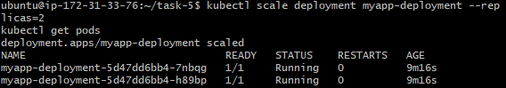
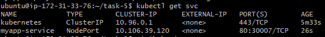
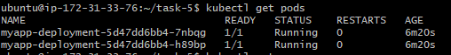

# Task 5 - Kubernetes Deployment on Minikube (EC2 Ubuntu)

## 📌 Objective
Deploy and manage an application on Kubernetes using Minikube inside an EC2 Ubuntu instance.

---

## 🛠 Tools Used
- **Minikube** - Local Kubernetes cluster
- **kubectl** - Kubernetes CLI for managing resources
- **Docker** - Containerization platform
- **Ubuntu (EC2)** - Cloud instance for running Kubernetes

---

## 📂 Steps Performed

### 1️⃣ Started Minikube
```bash
minikube start --driver=docker --cpus=2 --memory=1024mb
```

### 2️⃣ Built Docker Image and Loaded into Minikube
```bash
docker build -t myapp:v1 .
minikube image load myapp:v1
```

### 3️⃣ Created Deployment and Service
Applied Kubernetes manifests:
```bash
kubectl apply -f deployment.yaml
kubectl apply -f service.yaml
```

### 4️⃣ Verified Application Running
- Accessed app inside Minikube network
- Verified response with `curl`


---

### 5️⃣ Scaled Deployment
```bash
kubectl scale deployment myapp-deployment --replicas=2
kubectl get pods
```



---

### 6️⃣ Checked Services
```bash
kubectl get svc
```



---

### 7️⃣ Verified Pods Deployment
```bash
kubectl get pods
```



---

## ✅ Outcome
- Successfully deployed and scaled application on Kubernetes
- Learned to expose app using NodePort service
- Verified pods and services status


